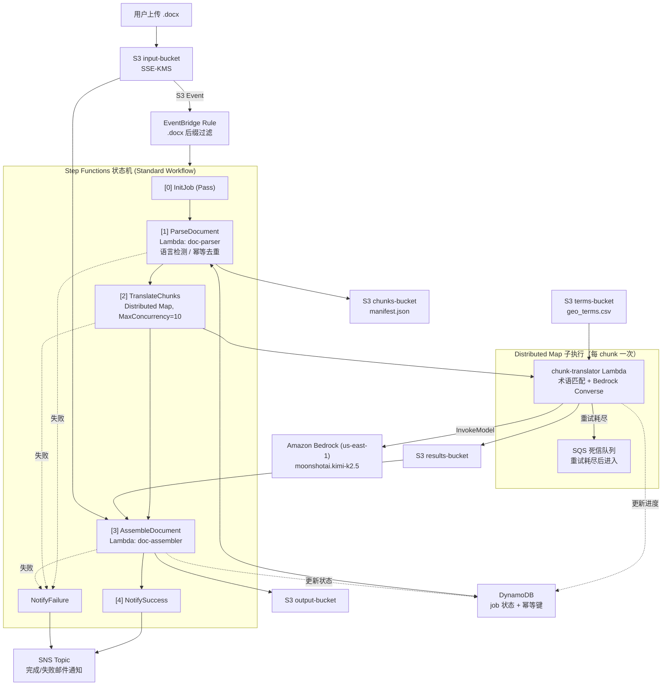
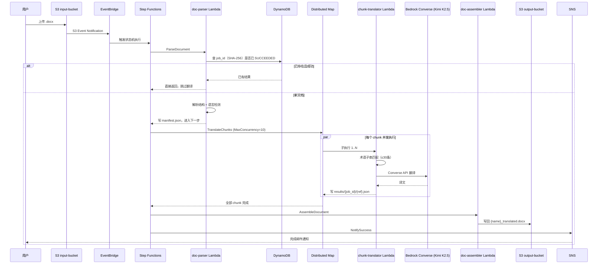

# 架构文档

## 目标

验证一套全 Serverless 的地理领域 `.docx` 文档中英自动翻译系统：用 Step Functions Distributed Map 对大文档做无上限并发分段翻译，用 Amazon Bedrock（Kimi K2.5）做语义翻译，同时保留 Word 原始格式并保证地理专业术语一致。

## 组件

- **存储**：5 个 S3 桶（input / chunks / results / output / terms），全部 SSE-KMS 加密（单个 CMK，自动轮换）
- **触发**：S3 Event Notification → EventBridge Rule，按 `.docx` 后缀过滤
- **编排**：AWS Step Functions（Standard Workflow），状态机 `statemachine/translation_workflow.asl.json`，开启 X-Ray 追踪
- **计算**：3 个 Lambda（python3.12，1024MB，900s timeout）
  - `doc-parser`：解析 docx 结构（正文/表格/页眉/页脚）、字符集统计判断源语言、SHA-256 内容哈希做幂等去重
  - `chunk-translator`：Step Functions Distributed Map（`MaxConcurrency=10`）的子执行体，按段子串匹配术语表（≤30条注入提示词）后调用 Bedrock Converse API 翻译，指数退避重试最多 5 次
  - `doc-assembler`：按 `ref` 键精确回填译文，段落级格式保留，重组为 `.docx`
- **模型**：`moonshotai.kimi-k2.5`，通过 Bedrock **Converse API** 调用，部署在 `us-east-1`（Bedrock 不在 AWS 中国区提供）
- **状态与可观测性**：DynamoDB 记录 job 状态与幂等键（TTL 30 天）；SQS 死信队列承接翻译失败的 chunk；CloudWatch 3 类告警（Step Functions 失败、DLQ 堆积、doc-assembler 耗时逼近超时）
- **通知**：Step Functions 原生 SNS Publish（无需额外 Lambda），完成/失败均发邮件

## 架构图

用户上传 `.docx` 到 input-bucket 后，S3 事件经 EventBridge 触发状态机。`doc-parser` 先对文档内容算 SHA-256 生成 `job_id`，若 DynamoDB 中已是 `SUCCEEDED` 则直接短路返回，否则解析文档结构、判断源语言，把分段清单写入 chunks-bucket 的 `manifest.json`。

`TranslateChunks` 用 Distributed Map 按清单并发拉起最多 10 个 `chunk-translator` 子执行，每个子执行读取术语表命中项拼进提示词，调用 Bedrock Converse API 完成单段翻译并写入 results-bucket；失败的 chunk 重试耗尽后进入 SQS 死信队列。`doc-assembler` 汇总所有分段结果，按 `ref` 键回填进原始 `.docx` 结构，写入 output-bucket。全流程无论成功失败，Step Functions 都会调用 SNS 发送邮件通知。

## 请求路径图

## 关键技术点

- **语言检测用字符集统计而非 LLM**：采样前 20 个 chunk，统计 CJK 汉字占比 > 0.15 判定为中文，避免中英混排的地理文档被 `langdetect` 误判，且零 API 费用、毫秒级
- **chunk `ref` 设计**：正文 `paragraph_{para_idx}`（`para_idx` 来自 `enumerate(doc.paragraphs)`，含空段落）、表格 `table_{t}_{r}_{c}`、页眉 `header_{s}_{p}`、页脚 `footer_{s}_{p}`，是重组阶段精确回填的唯一定位符
- **术语匹配分级**：< 1,000 条全量注入提示词；1,000–10,000 条（默认）用 Lambda 内存子串匹配，每 chunk 只注入命中术语；> 10,000 条才考虑向量检索（OpenSearch Serverless 最小 2 OCU 常驻约 $350+/月，小术语表绝不启用）
- **格式保留边界**：默认段落级保留（样式、对齐、整段字体字号），段落内局部加粗/斜体/颜色等 inline 格式不保证保留
- **幂等性**：`job_id` = 文档内容 SHA-256 前 16 位，重复上传同一文件直接复用已有结果，不重复计费
- **中国区适用性**：Amazon Bedrock 不在 AWS 中国区提供，本系统需部署在海外 Region（如 `us-east-1`）；若必须在中国区落地，可改用 Amazon Translate + Custom Terminology 路线，质量略降但满足数据不出境要求
- **成本量级**：以 100 页 Word（约 1,000 段落）为基准，变动成本约 $1.46/文档（Bedrock 输入输出 tokens 约占 $0.59，Lambda 约 $0.83），不调用则无固定费用（术语表超 10,000 条启用 OpenSearch Serverless 除外）
